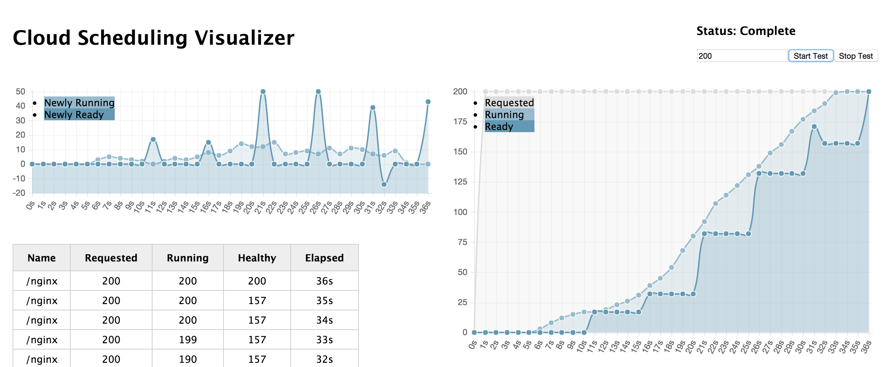

# Cloud Scheduling Visualizer

Web app for visualizing the scheduling of app instances over time.




## Dependencies

- [Docker](https://docs.docker.com/installation/)
- Make


## Compilation

Build a containerized app image:

```
make
```


## Operation

### Docker

Run in Docker:

```
make run
```

Exposes the web-ui on port 8080 of localhost (or your docker-machine IP).

(ctrl-c to quit)


### Marathon

Run in [Marathon](https://mesosphere.github.io/marathon/) on [DCOS](https://mesosphere.com/product/):

```
dcos marathon add marathon-dcos.json
```

Run in [Marathon](https://mesosphere.github.io/marathon/) on [mesos-compose-dind](https://github.com/karlkfi/mesos-compose-dind):

```
curl -H 'Content-Type: application/json' -X POST -d @"marathon-local.json" ${MARATHON_URL}/v2/apps
```

### Kubernetes

Run in [Kubernetes](http://kubernetes.io/):

```
kubectl create -n default -f kubernetes.yaml
```

Port Forward to expose the service:

```
kubectl port-forward -n default service/cloud-sched-viz 8080:80
```

Delete the resources:

```
kubectl delete -n default -f kubernetes.yaml
```

## Usage

Visit the home page at http://localhost:8080/

Set the number of instances in the test form field.
Start the test with the 'Start Test' button.
Stop the test with the 'Stop Test' button.

See the progress over time in the table.


## License

   Copyright 2015 Karl Isenberg

   Licensed under the [Apache License Version 2.0](LICENSE) (the "License");
   you may not use this project except in compliance with the License.

   Unless required by applicable law or agreed to in writing, software
   distributed under the License is distributed on an "AS IS" BASIS,
   WITHOUT WARRANTIES OR CONDITIONS OF ANY KIND, either express or implied.
   See the License for the specific language governing permissions and
   limitations under the License.
